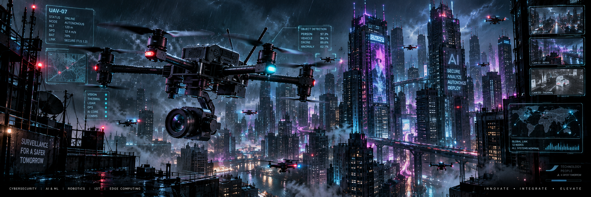

  
  <h1>PRIYAANSH JAISWAL</h1>
  <h3>CYBERSECURITY · AI/ML · ROBOTICS · IoT · EDGE AI</h3>
  
<strong>Building secure, intelligent systems that connect software with the physical world.</strong>

  

    <a href="https://github.com/priyaansh21">GitHub</a> ·
    <a href="YOUR_LINKEDIN_URL">LinkedIn</a> ·
    <a href="mailto:YOUR_EMAIL">Email</a>
  

<h2>⚡ ENGINEERING PROFILE</h2>

<strong>B.Tech (Hons.) CSE | Cybersecurity | RV University, Bengaluru</strong>

I build across the intersection of cybersecurity, AI, computer vision, robotics, IoT, networking and edge computing.

My focus is turning ideas into working systems:

<code>ARCHITECT</code> → <code>BUILD</code> → <code>TEST</code> → <code>SECURE</code> → <code>DEPLOY</code>

<h2>🧩 CORE STACK</h2>

<table width="100%">
  <thead>
    <tr>
      <th align="left">Domain</th>
      <th align="left">Technologies</th>
    </tr>
  </thead>
  <tbody>
    <tr>
      <td><strong>Cybersecurity</strong></td>
      <td>Wireshark · Nmap · Nessus · FTK Imager · RegRipper · ExifTool</td>
    </tr>
    <tr>
      <td><strong>AI / ML</strong></td>
      <td>Python · OpenCV · YOLOv8 · MediaPipe · scikit-learn · LSTM</td>
    </tr>
    <tr>
      <td><strong>Robotics / Edge</strong></td>
      <td>Drones · Jetson Xavier NX · CUDA · Arduino · ESP32</td>
    </tr>
    <tr>
      <td><strong>Systems</strong></td>
      <td>Linux · Networking · Sockets · Multithreading · Docker</td>
    </tr>
    <tr>
      <td><strong>Development</strong></td>
      <td>Flask · SQLite · Git · GitHub Actions · Java · C · SQL</td>
    </tr>
  </tbody>
</table>

<h2>🚁 FEATURED SYSTEM</h2>

<h3>SWARM</h3>

<strong>Strategic Warfare Autonomous Response Mechanism</strong>

Autonomous multi-drone surveillance platform combining computer vision, edge AI and real-time monitoring.

  <code>YOLOv8</code> <code>OpenCV</code> <code>MediaPipe</code> <code>OpenPose</code> <code>LSTM</code> <code>CUDA</code> <code>Flask</code> <code>Jetson Xavier NX</code>

<strong>Focus:</strong> Real-time detection · Edge inference · Drone systems · Telemetry · AI deployment

<h2>🛡️ SECURITY + AI</h2>

<h3>Security ML Work</h3>
<ul>
  <li><strong>Malicious URL Detection:</strong> Supervised classification + unsupervised analysis.</li>
  <li><strong>Anomaly Detection:</strong> K-Means based security anomaly analysis.</li>
  <li><strong>Spam Detection:</strong> Machine-learning classification and preprocessing.</li>
  <li><strong>Digital Forensics:</strong> FTK Imager · RegRipper · ExifTool · MVT · ADB</li>
</ul>

<h2>🌐 NETWORK + INFRASTRUCTURE</h2>

<h3>Smart Airport Network Infrastructure</h3>

Enterprise-style segmented network designed with Cisco Packet Tracer.

<code>VLANs</code> · <code>Network Segmentation</code> · <code>Server Zones</code> · <code>Department Isolation</code>

<h3>Other Systems</h3>
<ul>
  <li><strong>Smart Hotel &amp; Command HQ Network</strong></li>
  <li><strong>Threaded Python Web Server:</strong> Secure / segmented network architectures</li>
</ul>

<h2>🔌 IoT + EMBEDDED</h2>

<h3>Sensory Portal Interaction System</h3>

<strong>Built around:</strong>

<code>Arduino Uno</code> · <code>RC522 RFID</code> · <code>MQ2</code> · <code>LED Feedback</code>

<strong>Focus:</strong> embedded programming, sensing, assistive interaction and hardware-software integration.

<h2>🧪 OTHER PROJECTS</h2>

<table width="100%">
  <thead>
    <tr>
      <th align="left">Project</th>
      <th align="left">Area</th>
      <th align="left">Stack</th>
    </tr>
  </thead>
  <tbody>
    <tr>
      <td><strong>GraphiteForge</strong></td>
      <td>Computer Vision</td>
      <td>Flask · OpenCV · Python</td>
    </tr>
    <tr>
      <td><strong>BillGenie</strong></td>
      <td>Desktop Software</td>
      <td>Python · Tkinter</td>
    </tr>
    <tr>
      <td><strong>AstroGuide</strong></td>
      <td>OOP / GUI</td>
      <td>Java</td>
    </tr>
    <tr>
      <td><strong>MemoryVault</strong></td>
      <td>Database Systems</td>
      <td>SQL · DBMS</td>
    </tr>
    <tr>
      <td><strong>Travel Planner</strong></td>
      <td>Web Development</td>
      <td>Flask · SQLite</td>
    </tr>
    <tr>
      <td><strong>Smart Hotel Network</strong></td>
      <td>Networking</td>
      <td>Cisco Packet Tracer · VLAN</td>
    </tr>
  </tbody>
</table>

<h2>🏢 EXPERIENCE</h2>

<ul>
  <li><strong>IISc Rhapsody 3.0:</strong> Drone systems and autonomous technology.</li>
  <li><strong>Agnirva Space Internship:</strong> Technology and engineering exposure within the space-tech ecosystem.</li>
  <li><strong>Vikasya Hackathon:</strong> Rapid prototyping, implementation and technical problem solving.</li>
  <li><strong>Adobe Hackathon:</strong> Participated in a large-scale technology hackathon.</li>
</ul>

<h2>📊 GITHUB</h2>

  
  
    
  

<h2>🎯 CURRENT FOCUS</h2>

  <code>Cybersecurity</code> · <code>AI Security</code> · <code>Computer Vision</code> · <code>Edge AI</code> · <code>Robotics</code> · <code>IoT</code> · <code>Secure Infrastructure</code>

 

  
<strong>BUILD · SECURE · INTELLIGENT · AUTONOMOUS</strong>

  
<strong>INNOVATE • INTEGRATE • ELEVATE</strong>

    
  PRIYAANSH JAISWAL · CYBERSECURITY × AI × ROBOTICS × IoT

